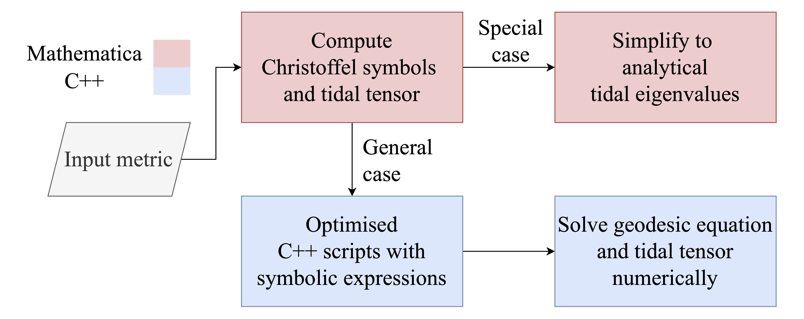

# Tidal ZAMO: Geodesic and local tidal tensor calculations

This repository provides tools for numerical integration of (time-like) particle geodesics and the calculation the local tidal tensor along along its trajectory.

This work is part of [Xin and Mummery 2025](https://doi.org/10.48550/arXiv.2511.21499). The paper discusses the theoretical background supporting the code implementation, as well as astrophysical applications of tidal tensors.

Please cite the paper if you use this code in your research.

## Overview

The example background spacetime is a Kerr-Newman black hole characterized by spin and charge, but in principle any stationary, axisymmetric metric can be implemented.

The repository is structured into two main components:

1. **Integrator**: C++ code for numerical integration of geodesics and computation of tidal tensors along the trajectory.
2. **Mathematica Notebooks**: Symbolic calculations of metric, Christoffel symbols, and local tidal tensors for different spacetimes.

The overall workflow is illustrated below:



## Integrator

The `integrator_unified/` directory contains the C++ code for integrating geodesics and computing tidal tensors.

We implement the Dormand-Prince 8(5,3) Runge-Kutta method with adaptive step sizing for numerical integration. See [Press2007, Chapter 17] for details.

### File Structure

- `def.h`: Global variable and constant definitions.
- `main.cpp`: Main program and parameter handling.
- `diffeqs.cpp`: Generation of equation systems according to geodesic equations.
- `raytracing.cpp`: Integration routines and geodesic equations.
- `eigen_compute.cpp`: Tensor eigenvalue analysis.
- `metric.cpp`: Spacetime metric calculations, supplied by Mathematica notebooks.
- `christoffel.cpp`: Christoffel symbol computations, supplied by Mathematica notebooks.
- `Cloc_newman.cpp` and `Cloc_spherical.cpp`: Local tidal tensor calculations for Kerr-Newman and Schwarzschild spacetimes, respectively, supplied by Mathematica notebooks.
- Additional utility files.

### Building and Dependencies

#### Required Libraries

- Standard C++ libraries.
- Eigen library (for eigenvalue computation) which is already included in the repository under `./Eigen`.

#### Compilation

```bash
g++ -O3 main.cpp -o main
```

### Basic Command Line Interface

``bash
./main <spin> <charge> <lam> <x> <total_iterations> <scale> <eigenswitch>
``

### Parameters and Descriptions

| Parameter | Type | Description | Default |
|-----------|------|-------------|---------|
| `spin` | double | Dimensionless spin parameter $a/M$ (0 <= `spin` <= 1) | 0.5 |
| `charge` | double | Dimensionless charge parameter $Q/M$ (0 <= `charge` <= 1) | 0.5 |
| `lam` | double | Cosine of inclination angle (0 <= `lam` <= 1) | 0.5 |
| `x` | double | IBSO radius (see below) | 2.701418260779751 |
| `total_iterations` | int | Maximum integration steps | 10000 |
| `scale` | double | Scale factor for angular momentum lz | 1.0 |
| `eigenswitch` | int | Enable/disable eigenvalue computation along trajectory (0/1) | 1 |

- **spin**: Black hole rotation parameter. Set to 0 for spherical spacetime.
- **charge**: Electric charge of the black hole. Combined with `spin` determines if system is in black hole (`spin**2 + charge**2 <= 1`) or naked singularity (`spin**2 + charge**2 > 1`) regime.
- **lam**: Controls orbital inclination. `lam=1` means equatorial orbit (`theta=0`), `lam=0` means polar orbit (`theta=pi/2`).
- **x**: The radius of the Innermost Bound Spherical Orbit (IBSO) for given `spin`, `charge`, and `lam`. By specifying the IBSO radius, the programme calculates the required initial angular momentum so that the photon travels on an IBSO, which is an orbit that starts from infinity but approaches the IBSO radius asymptotically. For generic orbits, one needs to modify the handling of initial conditions in `main.cpp` to allow for arbitrary angular momentum.
- **total_iterations**: Controls simulation duration and precision.
- **scale**: Modifies the angular momentum to explore different orbital configurations.
- **eigenswitch**: Set to 0 to disable eigenvalue computation for faster execution.

N.B.: We assume that particles are all of unit energy ($\epsilon=1$) throughout the simulation. This limitation may be lifted by modifying the initial conditions in `main.cpp`.

### Examples

#### 1. Default Kerr-Newman BH

```bash
./main 0.5 0.5 0.5 2.701418260779751 10000 1.0 1
```

The same parameters as the default values. Sets the particle on an IBSO around a Kerr-Newman black hole with spin=0.5, charge=0.5, and inclination corresponding to lam=0.5.

#### 2. Schwarzschild BH

```bash
./main 0.0 0.0 0.0 4.0 10000 1.0 1
```

This sets the background spacetime to Schwarzschild (non-rotating, uncharged) and we use the well-known IBCO (circular equivalent of IBSO) radius of $r=4M$. Orbital inclination is irrelevant in this case and is set to zero (in fact, the programme will enforce `lam=0` whenever `spin=0`).

### Output Files

The program generates output files in the `data/` directory:

#### Trajectory Data

- **Filename**: `trace_a_[spin]_Q_[charge]_lambda_[lam]_[pro/ret].dat`
- **Format**: `t r chi phi kt kr kchi kphi affine_parameter`
- **Description**: `t`, `r`, `chi`, and `phi` are Boyer-Lindquist coordinates; `kt`, `kr`, `kchi`, and `kphi` are the proper time derivatives of the corresponding coordinates. `affine_parameter` in this case is the proper time `tau` along the trajectory.

**N.B.**: `chi` is related to the polar angle coordinate `theta` by `chi = cos(theta)`. Therefore the time derivatives are related by `kchi = -sin(theta) * ktheta`. The trigonometric substitution is used to improve computation speed.

#### Eigenvalue Data (if eigenswitch=1)

- **Filename**: `eigensystem_a_[spin]_Q_[charge]_lambda_[lam]_[pro/ret].dat`
- **Description**: Tidal tensor eigenvalues and eigenvectors at each trajectory point.

#### Output Labels

- `pro`: Prograde orbit ($l_z > 0$).
- `ret`: Retrograde orbit ($l_z < 0$).

## Mathematica Notebooks

The `notebooks/` directory contains Mathematica notebooks for symbolic calculations of several tensor (matrix) quantities:

- Metric
- Christoffel symbols
- Local tidal tensor

They are calculated by the notebook and exported as C++ files which are included in the integrator code:

- `metric_tensor.cpp`
- `christoffel_symbols.cpp`
- `Cloc_newman.cpp` (for Kerr-Newman tidal tensor) and `Cloc_spherical.cpp` (for Schwarzschild tidal tensor)

### Notebook Files

- `tidal_tensor_kerr.nb`: Kerr spacetime (special case of Kerr-Newman with zero charge).
- `tidal_tensor_newman.nb`: Kerr-Newman spacetime.
- `tidal_tensor_spherical.nb`: General spherically symmetric spacetime with verifications against a wide range of known results.
- `tidal_tensor_wormhole.nb`: A rotating wormhole [Teo1998].

### Workflow of Symbolic Calculation

We use `tidal_tensor_newman.nb` as an example to illustrate the workflow.

The notebook is divided into several sections:

#### 0. Define Helper Functions

Functions for tensor operations, coordinate transformations, etc. Do not modify this section unless necessary.

#### 1. Construct Metric and LNRF Tetrad

Input the metric components for the desired spacetime (Kerr-Newman in this case). Always use Boyer-Lindquist coordinates. We follow the metric definition set out in [Bardeen1972]:

$$
\mathrm{d}s^{2} = -e^{2\nu} \mathrm{d}t^{2} + e^{2\psi} \left( \mathrm{d}\phi - \omega \mathrm{d}t \right)^{2} + e^{2\mu_{1}} \mathrm{d}r^{2} +  e^{2\mu_{2}} \mathrm{d}\theta^{2}
$$

where $\nu$, $\psi$, $\mu_{1}$, $\mu_{2}$, and $\omega$ are functions of $r$ and $\theta$ only to be specified by the user.

Next, we define the first integrals of time-like geodesics for KN spacetime. This step is not strictly necessary for constructing the tidal tensor, which in general depends on both 4-positions and 4-velocities. The first integrals can be used to replace 4-velocity with 4-positions and constants of motion, but numerical integration can always provide 4-velocities directly. Here we are substituting the first integrals to verify the tidal tensor against known results in the literature; the output C++ code will still contain 4-velocity components as variables.

Then we assemble the metric tensor and construct the Locally Non-Rotating Frame (LNRF) tetrad. This should be possible for any stationary, axisymmetric spacetime.

#### 2. Compute Riemann Tensors in LNRF

We first compute the Riemann tensor in the distant observer frame using the standard `ResourceFunction["RiemannTensor"]` function.

Then the Riemann tensor is projected into the LNRF using the tetrad defined in the previous section. Next the 4-velocity is also projected from the distant observer frame into the LNRF.

#### 3. Compute Tidal Tensors and Test

Now we can compute the tidal tensor in the LNRF using the projected Riemann tensor and 4-velocity.

The next step is to use Lorentz boosts to boost the LNRF tidal tensor into the particle's locally free-falling frame, giving us `ClocH` as the desired local tidal tensor.

Finally, we can test some known properties of the tidal tensor:

1. Symmetry: $C_{\mu\nu} = C_{\nu\mu}$.
2. Always has one row and one column of zeros corresponding to the time direction, implying a zero determinant.
3. Trace is dependent on the Ricci tensor.

For the Kerr spacetime, we also verify against tidal eigenvalues reported in the literature (e.g. [Marck1983]).

#### 4. Numerical Simulation

Once the tidal tensor is verified, we can export the relevant C++ code for inclusion in the integrator programme.

Note that since the C++ code uses the coordinate $\chi = \cos(\theta)$, we need to perform the substitution $\theta \to \arccos(\chi)$ before exporting.

## References

- Bardeen1972 - Rotating black holes: locally nonrotating frames, energy extraction, and scalar synchrotron radiation
- Marck1983 - Solution to the equations of parallel transport in kerr geometry; Tidal tensor
- Teo1998 - Rotating traversable wormholes
- Press2007 - Numerical recipes

## Acknowledgements

This work is inspired by [RayTransfer](https://github.com/ABHModels/raytransfer), which is also released under GNU GPLv3. The author would like to thank the authors of [RayTransfer](https://github.com/ABHModels/raytransfer) for making their work open source.
